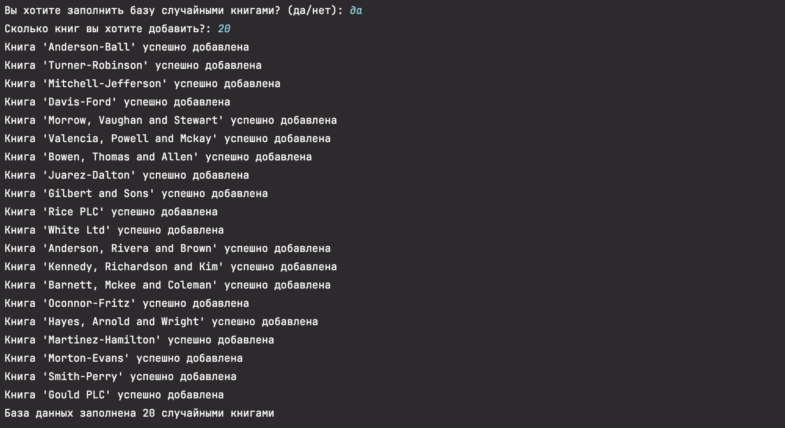
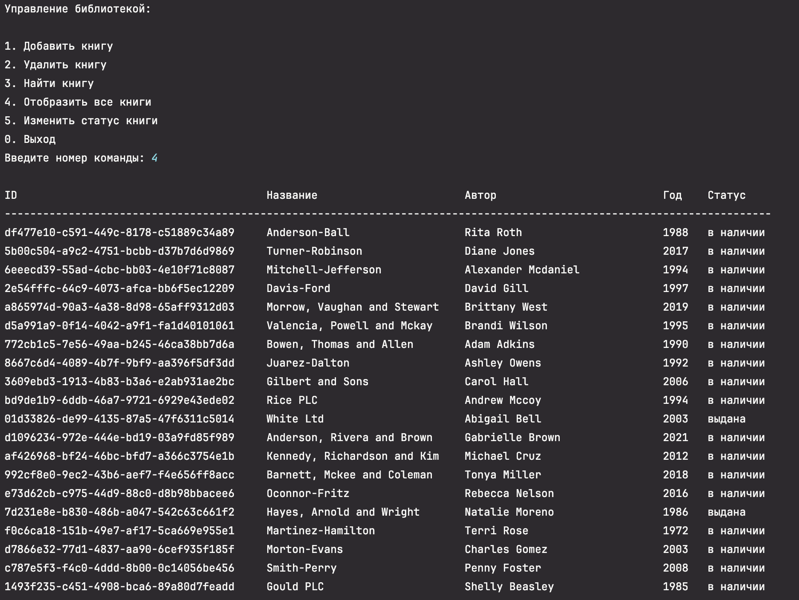
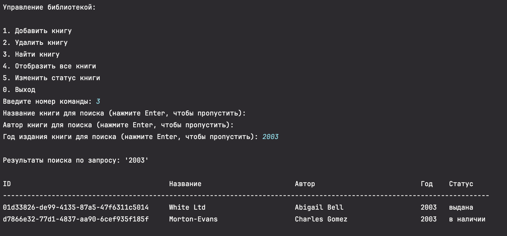
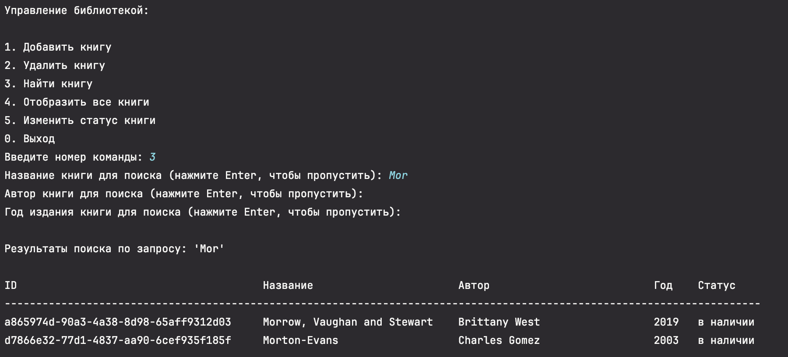
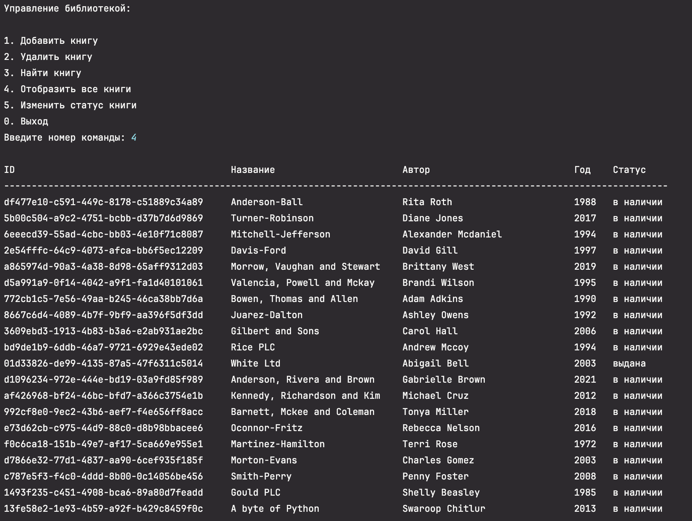

# Примеры

- Генерация случайных книг
  

- Список всех книг
  

- Отказ от заполнения базы данных случайными книгами
  

- Изменение статуса книги на `"выдан"` и повторная попытка задать тот же статус
  

- Список всех книг, после изменения статуса
  

- Удаление книги по `id`
  

- Поиск книг по _году издания_
  

- Поиск книг по _названию_
  

- Добавление новой книги
  

- Список всех книг после добавления
  

- Выход из приложения
  
